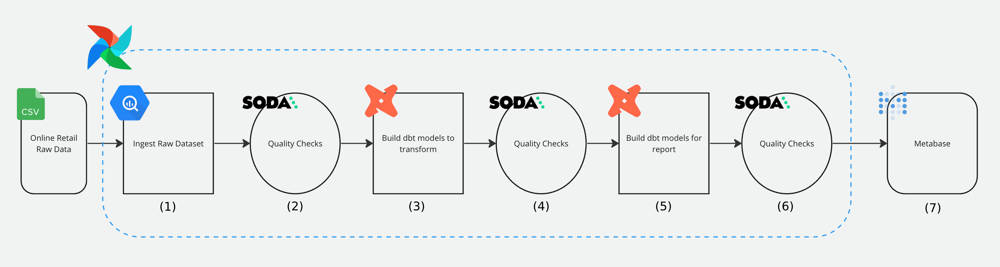

# Retail Project: An end-to-end Airflow data pipeline with BigQuery, dbt Soda, and more!




## Steps

1) Upload raw dataset, a CSV file, in a GCS bucket (https://console.cloud.google.com/); then, with data pipeline ingest the raw data from GCS bucket into a BigQuerry table -- this is automatically created using the astro SDK and the load file operator
2) Implement data quality checks using Soda (https://cloud.us.soda.io/) and external Python operator which allows execute code in python virtual enviroment to avoid dependency conflicts
3) Create DBT models in order to generate dimention and fact tables by using Cosmos which best integrate DBT with Airflow
4) Create some additional quality checks to verify that transform data is correct
5) Create all DBT models to generate metrics from the transform data from the dimention and fact tables
6) Implement the last data quality checks to ensure metrics are correct
7) Create a Dashboard that shows data in action using Metabase! http://localhost:3000/


## Project Contents

Your Astro project contains the following files and folders:

- dags: This folder contains the Python files for your Airflow DAGs.
- Dockerfile: This file contains a versioned Astro Runtime Docker image that provides a differentiated Airflow experience. If you want to execute other commands or overrides at runtime, specify them here.
- include: This folder contains any additional files that you want to include as part of your project. It is empty by default.
- packages.txt: Install OS-level packages needed for your project by adding them to this file. It is empty by default.
- requirements.txt: Install Python packages needed for your project by adding them to this file. It is empty by default.

## Deploy Your Project Locally

1. Initialize your project `astro dev init`.
2. Start Airflow on your local machine by running 'astro dev start'.

This command will spin up 4 Docker containers on your machine, each for a different Airflow component:

- Postgres: Airflow's Metadata Database
- Webserver: The Airflow component responsible for rendering the Airflow UI
- Scheduler: The Airflow component responsible for monitoring and triggering tasks
- Triggerer: The Airflow component responsible for triggering deferred tasks

3. Verify that all 4 Docker containers were created by running 'docker ps'.

Note: Running 'astro dev start' will start your project with the Airflow Webserver exposed at port 8080 and Postgres exposed at port 5432. If you already have either of those ports allocated, you can either [stop your existing Docker containers or change the port](https://docs.astronomer.io/astro/test-and-troubleshoot-locally#ports-are-not-available).

4. Access the Airflow UI for your local Airflow project. To do so, go to http://localhost:8080/ and log in with 'admin' for both your Username and Password.

You should also be able to access your Postgres Database at 'localhost:5432/postgres'.

---
**IMPORTANT!**

**Open the Dockerfile and make sure you use [quay.io/astronomer/astro-runtime:8.8.0](https://www.youtube.com/redirect?event=comments&redir_token=QUFFLUhqbmNvZnZoRXA5bXpQOTNXSjJFZ0N4TUNlZTZjQXxBQ3Jtc0ttOUw0YlNjX0w4N2xOSGg1dEF5Tzc3YU9KTm9HalozVmtsUmpmMkd4MnBhSnpkNVRQdGJsZzZpNjlZWHdRNkFKM1BMWl9zTW1TSGNUbGV5QW1zU2UybURaMHN0SUs5cnpGaFVTQkJTdUp5LVNzUWIycw&q=http%3A%2F%2Fquay.io%2Fastronomer%2Fastro-runtime%3A8.8.0&stzid=UgwO3rRwDpXPy4ZgDbt4AaABAg) in the Dockerfile (or airflow 2.6.1), If not, use that version and restart Airflow (`astro dev restart` with the Astro CLI)**


## Pipeline steps

- [ ]  Download the dataset https://www.kaggle.com/datasets/tunguz/online-retail
    - [ ]  Store the csv file in `include/dataset/online_retail.csv`
- [ ]  In requirements.txt, add `apache-airflow-providers-google==10.3.0` restart Airflow.
    - [ ]  Find out the relevant service in https://registry.astronomer.io/
- [ ]  Create a GCS bucket with a unique name `<your_name>_online_retail`
- [ ]  Create a service account with a name `airflow-online-retail`
    - [ ]  Grant admin access to GCS + BigQuery
    - [ ]  Click on the service account → Keys → Add Key → Copy the JSON content
    - [ ]  Create a new file `service_account.json` in `include/gcp/`
    - [ ]  Airflow → Admin → Connections
    - id: gcp
    - type: Google Cloud
    - Keypath Path: `/usr/local/airflow/include/gcp/service_account.json`
- [ ]  Test the connection → Save (**from 2.7 must be turned on**)

🏆 GCP configured and connected to airflow!

- [ ]  Create the DAG data pipeline
- [ ]  Test the task
    
    ```bash
    astro dev bash
    airflow tasks test retail upload_csv_to_gcs 2023-01-01
    ```
    
- [ ]  Create an empty Dataset (schema equivalent)    
- [ ]  Create the task to load the file into a BigQuery `raw_invoices` table
    - [ ] Using astro SDK https://astro-sdk-python.readthedocs.io

🏆 Data loaded into the warehouse!

- [ ]  Install Soda Core
    - [ ]  In requirements.txt
        ```bash
        soda-core-bigquery==3.0.45
        ```
    - [ ]  Create a `configuration.yml`
        project_id is found in GCP
    - [ ]  Create a Soda Cloud account (https://docs.soda.io/)
    - [ ]  Create an API → Profile → API Keys → Create API → Copy API in `configuration.yml`        
    - [ ]  Test the connection        
        ```bash
        astro dev bash
        soda test-connection -d retail -c include/soda/configuration.yml
        ```
        
    - [ ]  Create the first test for `include/soda/checks/sources/raw_invoices.yml`        
    - [ ]  Run the quality check
        ```yaml
        soda scan -d retail -c include/soda/configuration.yml include/soda/checks/sources/raw_invoices.yml
        ```
    - [ ]  Create the check function        
    - [ ]  Create the python virtual env        
    - [ ]  In the DAG, create a new task        
        <aside>
        💡 ExternalPython uses an existing python virtual environment with dependencies pre-installed. That makes it faster to run than the VirtualPython where dependencies are installed at each run
        
        </aside>
        
    - [ ]  Test the task
        ```python
        astro dev bash
        airflow tasks test retail check_load 2023-01-01
        ```
        
🏆 First data quality check in place!

### Transform

- [ ]  Install Cosmos - DBT
    - [ ]  In requirements.txt        
    - [ ]  In env (required because of conflicts)
        
        ```python
        PROTOCOL_BUFFERS_PYTHON_IMPLEMENTATION=python
        ```
        
    - [ ]  In Dockerfile
        
        ```docker
        # install dbt into a virtual environment
        RUN python -m venv dbt_venv && source dbt_venv/bin/activate && \
            pip install --no-cache-dir dbt-bigquery==1.5.3 && deactivate
        ```
        
    - [ ]  Restart
        
        ```python
        astro dev restart
        ```
        
- [ ]  Create `include/dbt`
- [ ]  Go to BigQuery
- [ ]  Execute the following SQL request (create Country table)

- [ ]  In `models/sources`
        ```yaml
        # sources.yml
        ```

- [ ]  In `models/transform`
    -- Create the dimension and fact tables

- [ ]  Run the models
    
    ```bash
    astro dev bash
    source /usr/local/airflow/dbt_venv/bin/activate
    cd include/dbt 
    dbt deps
    dbt run --profiles-dir /usr/local/airflow/include/dbt/
    ```
    Check on big queries that the tables exist with data
    
- [ ]  Add the task    
- [ ]  Create DBT_CONFIG
- [ ]  Test a task
    
    ```bash
    astro dev bash
    airflow tasks list retail
    airflow tasks test retail transform.dim_customer.dim_customer_run 2023-01-01
    airflow tasks test retail transform.dim_customer.dim_customer_test 2023-01-01
    ```
- [ ]  Go check out the Airflow UI, you should see a TaskGroup transform with the models

🏆 First dbt models to transform in place!

- [ ]  Add check files in include/soda/checks/transform
- [ ]  Add a new task in dags file

🏆 Data quality check to transforms in place!

### Reports

- [ ]  In `include/dbt/models/report`
- [ ]  Add a new task

🥇 Well done! You’ve finished the data pipeline

### Dashboard

- [ ]  Add new component to your astro environment by creating `docker-compose.override.yml` 
- [ ]  Add metabase to services


### References:
https://www.youtube.com/watch?v=DzxtCxi4YaA

https://robust-dinosaur-2ef.notion.site/PUBLIC-Retail-Project-af398809b643495e851042fa293ffe5b
